***This isn't meant to be an exhaustive guide! It just briefly covers the basics, so make sure to explore the various links for follow-on information & guides. If you have any questions don't hesitate to ask!***


# Hosting a honeypot
One of the most convenient ways to get a honeypot spun-up and exposed to the internet without the need for extra hardware at home, is by using an online provider. This is great for us as it doesn't require dealing with the potential hazards of exposing intentionally vulnerable services, from our own personal network. Especially considering that this is still a learning/research project and mistakes will probably be made. As always, just as @TreyCraf7 recommends, it's still best to try configuring, running and then prodding your honeypot internally first. This can be done using [virtualization](https://www.softwaretestinghelp.com/virtualbox-vs-vmware/) on your own machine/network. Of course, you'll be the only one who can touch the honeypot but it will serve as a good test run before deciding to spin up an internet-facing machine from a provider. 

I won't go into too much detail with all of the differences between various buzz words like cloud computing, VPS, virtual machine, instance, shared & dedicated resources, as well as all of the possiblities between each. Many are used interchangebly and you'll often get a conflicting answer depending on who you ask or what is being marketed. Most of the honeypots we're researching don't require much when it comes to system resources. That will allow us to use the cheaper end of these services. The cost typically adds up to only a few dollars per month. You'll most likely be able to conclude your honeypot research for free though, based on the many credits that various providers offer.

# Choosing a provider
There are a variety of providers to choose from when deciding where to spin up a virtual machine or instance for your honeypot. Some of the more common ones used are [Amazon's EC2](https://aws.amazon.com/ec2/?ec2-whats-new.sort-by=item.additionalFields.postDateTime&ec2-whats-new.sort-order=desc), [Google Cloud](https://cloud.google.com/compute), [Oracle Cloud](https://www.oracle.com/cloud/), [Digital Ocean](https://www.digitalocean.com/pricing/) and [Linode](https://www.linode.com/pricing/). Most of these companies will offer some sort of credit for new users. This will allow you to test out the service and/or certain system configuration for a given period of time, ranging from 30 days to 1 year in some cases (AWS EC2). You'll almost always have to input your credit card information when creating an account for one of these services.


---
Here's a few credit links to some popular providers:
* [AWS EC2 free-tier for 1 year](https://aws.amazon.com/free/?all-free-tier.sort-by=item.additionalFields.SortRank&all-free-tier.sort-order=asc)
* [Google $300/90 day credit](https://console.cloud.google.com/freetrial/signup/tos?pli=1)
* [Digital Ocean $100/60 day credit](https://m.do.co/c/406d0538c0e1)
* [Oracle $300/30 day credit](https://www.oracle.com/cloud/free/?source=:ow:o:p:nav:081520OCIHeroCallout&intcmp=:ow:o:p:nav:081520OCIHeroCallout)
* [Linode $100/60 day credit](https://www.linode.com/lp/youtube-viewers/?ifso=wolfgang)
---

Once you get signed up, you may want to set up [usage alerts](https://docs.aws.amazon.com/awsaccountbilling/latest/aboutv2/tracking-free-tier-usage.html), particularly with AWS EC2, to make sure you're not going over your free tier usage and being charged. Otherwise, If you don't want to be charged after these trial periods or credits expire, you need to remember to delete the machine(s) once you've concluded your research. **Of course, make sure to backup any important data or logs that you will need for later before deleting the machine!**

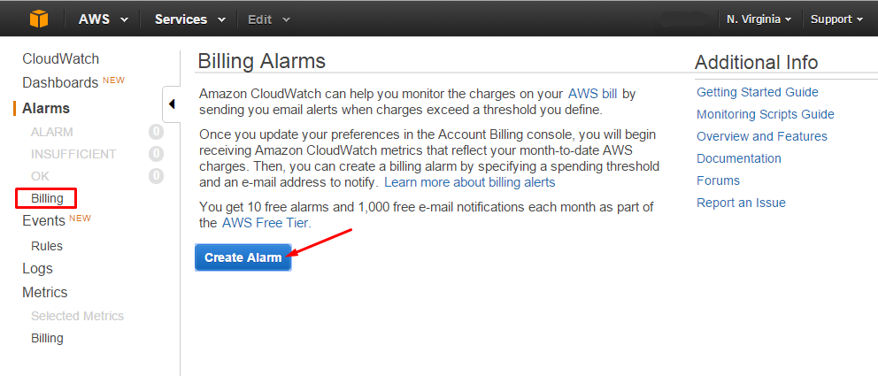
*AWS EC2 billing alarm setup.*

# Choosing a machine
Before deploying your first virtual machine, you'll have to choose a plan for it. This will determine what resources are allocated to your machine. You'll see a variety of options for different CPU, memory and storage options along with their respective pricing. You may see machines falling under "shared" or "dedicated" plans. Like we mentioned earlier, for our testing purposes the cheaper "shared" CPU plans will typically work fine. These boil down to multiple users sharing the resources of a physical machine. They're designed for usage situations that can handle variable levels of processing power unlike production workloads which may need their own dedicated resources. Depending on the provider, the low end of those shared plans typically will allocate ~1 CPU, ~1GB RAM and ~25GB of storage. You can make a choice based on the requirements of the honeypot you plan on running. Also consider any extra resources you may need if you plan to run some sort of logging platform on the same instance as the honeypot. 

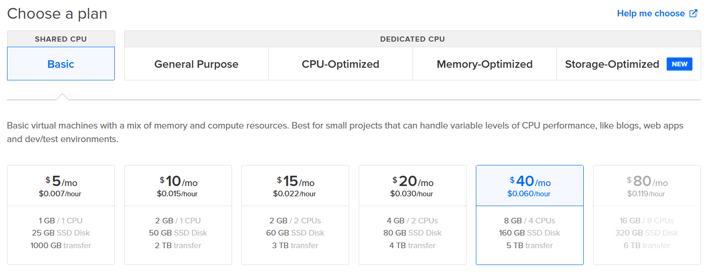
*Digital Ocean plan selection.*

You'll have to choose a region where the data center and thus the physical server housing your virtual machine, is located. This is an important consideration regarding latency, so it's usually best to choose something as close to your location as possible. 

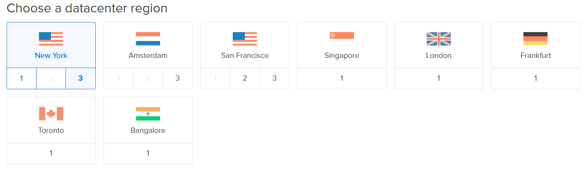
*Digital Ocean data center region selection.*

Along with choosing the resources for your machine, you'll have to select an image for it. Most providers will have various GNU/Linux distributions ready to select from or even have a marketplace full of various others for specific use cases. Most will allow you to upload your own custom image as well. The majority of honeypots we're currently researching, are centered around deployment in a Debian-based distro. 

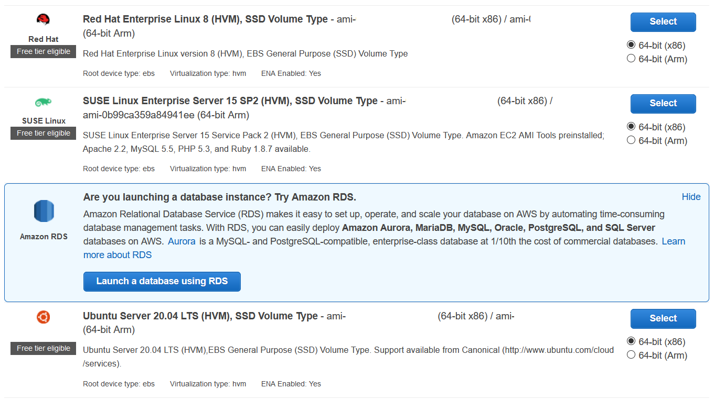
*Quick start EC2 Linux Amazon Machine Images (AMI).*

# Accessing your machine 
When creating the machine you'll be prompted to create a password. This password will be used to log into the [`root`](https://mediatemple.net/community/products/dv/204643890/an-introduction-to-the-root-user) user account. It's important to remember that the `root` user has the highest privileges and complete control over the entire system. This means it's important from a security standpoint, to set a very strong password or [passphrase](https://protonmail.com/blog/protonmail-com-blog-password-vs-passphrase/). I would highly recommend using [key-based authentication](https://www.ssh.com/ssh/public-key-authentication) instead of a password from the get-go, if your provider supports it during creation of the machine. We'll cover setting up key-based authentication later though, so you can just use a strong password for right now.  

We'll be interacting with our new machine through [SSH](https://www.hostinger.com/tutorials/ssh-tutorial-how-does-ssh-work). You'll most commonly work with SSH from the command-line if you're already on GNU/Linux, MacOS or even using [Windows Subsystem for Linux](https://docs.microsoft.com/en-us/windows/wsl/install-win10). Otherwise if you're on Windows, [PuTTY](https://www.putty.org/) is a popular SSH client. 

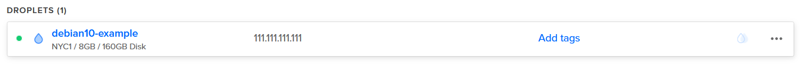
*Newly created Digital Ocean droplet (virtual machine). Note the public IP address, at which you can reach the machine via SSH.*

Since we're not using key-based authentication yet and only have the `root` password set. We can go ahead and open a terminal or PuTTY on our personal machine and SSH into our new server. From your terminal you can run ```$ ssh root@ipaddress```. It will attempt to connect on the default port 22 of your server. You'll be asked if you want to continue connecting, this happens when you connect to a new host for the first time. You can respond with `yes` to continue. 

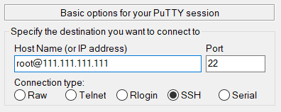

*Example of the PuTTY client. Note `user@ipaddress` format.*

# Hardening SSH
Since this server will soon be turned into a honeypot, there's some things we can do to ensure we retain secure administrative access. One of the best ways mentioned earlier, was to disable password authentication and use SSH keys instead. Another way involves disabling `root` login. We instead create a separate user with [`sudo`](https://www.linux.com/training-tutorials/linux-101-introduction-sudo/) privileges and log in as that new user going forward. This will help prevent the common [bruteforcing](https://blog.sucuri.net/2013/07/ssh-brute-force-the-10-year-old-attack-that-still-persists.html) attacks done against exposed SSH services, especially targeting the `root` user.

Before we start, it's important to note that we don't want to accidentally get locked out of our own system by making a mistake with SSH configuration changes. **Always keep at least one SSH session open during and after making changes. You can then open another terminal window and attempt to login and ensure the recent changes didn't lock you out!** Go ahead and SSH into you server, if you're not already and let's start by creating a new user.


Replace `username` with the user name you'd like to use. You'll be prompted to input a password. When asked to input user info, you can leave those fields blank and press `enter`.

`$ adduser username` 

Let's add our new user to the `sudo` group 

`$ usermod -aG sudo username`

[Switch](https://linuxize.com/post/su-command-in-linux/) over to the new user.

`$ su - username`

Then check to see if the user has their new sudo privileges. You may be prompted for the password you just created. The output should say `root`.

`$ sudo whoami`

### Generating a key pair
Now that we have a new user we can go ahead and start setting up key-based authentication. Let's go back over to our personal machine and open up another terminal there. It's time to [generate](https://www.ssh.com/ssh/keygen/) an SSH key pair. If you're using PuTTY on Windows, you'll need to download [PuTTYgen](https://www.puttygen.com/).

This will generate a 4096-bit RSA key pair. The default size is 2048-bit, which is typically fine as opposed to the larger 4096 bit key. You can leave the "file in which to save the key" default and press `enter`. You'll then be asked to set a password for the key.

`$ ssh-keygen -t rsa -b 4096`

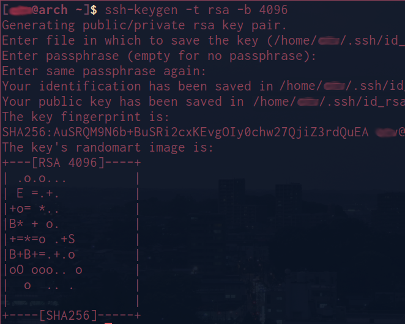

Your new SSH key pair is now in the `.ssh` directory within your home directoy (~/.ssh or /home/username/.ssh). The file called `id_rsa` is the private key (which is protected by the password you set) and your public key is `id_rsa.pub`. We now need to transfer the public key (`id_rsa.pub`) over to our honeypot server so the authentication can take place when we connect. There's a couple ways of doing so. If your version of SSH has the `ssh-copy-id` tool included (OpenSSH) then you can use that. Otherwise we have some other options. Let's start with the `ssh-copy-id` method.

*Method 1:
Give the command the IP address of your honeypot server as well as the username of the new user we created. You'll be prompted to enter the password for that user.*

`$ ssh-copy-id username@ipaddress` 

*Method 2:
This will utilize some interesting parts of GNU/Linux, including [pipes](https://www.geeksforgeeks.org/piping-in-unix-or-linux/) and [stream redirection](https://www.digitalocean.com/community/tutorials/an-introduction-to-linux-i-o-redirection).*

`$ cat ~/.ssh/id_rsa.pub | ssh username@ipaddress "mkdir -p ~/.ssh && cat >> ~/.ssh/authorized_keys"`

*Method 3:
The last method you can do is literally just copy and paste the public key over into the `~/.ssh/authorized_keys` file on your honeypot server. If the `authorized_keys` file doesnt exist, you can just create it! Use your favorite text editor to then paste the copied public key in.*

You can go ahead and test your key-based authentication now!

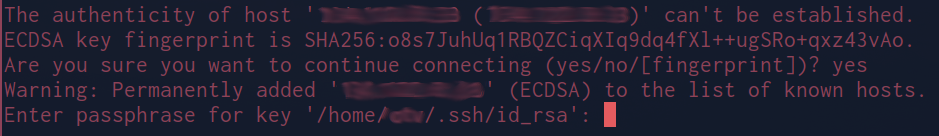

### Editing sshd_config
Now that we successfully created and tested our new key pair, we can edit the `sshd_config` file to disable root login and password authentication. Remember what we mentioned earlier about keeping a session open and using another terminal to test the changes to prevent a lockout! First let's make a backup of our current config file just out of good practice.

`$ cp /etc/ssh/sshd_config /etc/ssh/sshd_config.backup`

Next, use your preferred text editor ([vi](https://www.tutorialspoint.com/unix/unix-vi-editor.htm), [vim](https://www.linux.com/training-tutorials/vim-101-beginners-guide-vim/), [nano](https://linuxize.com/post/how-to-use-nano-text-editor/), etc.) and open the original config file `/etc/ssh/sshd_config`. You may need to use the `sudo` command in front of the text editor you choose, since the file requires elevated privileges to edit. 

Once in the file, locate the line `#PasswordAuthentication yes`. If it starts with a `#` symbol, that means that this line is currently "commented" and not active. Start by deleting the `#` symbol and then change the `yes` to `no`. This will disable password authentication and instead allow key-based. 

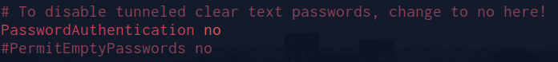

We can then look for the line `PermitRootLogin Yes` and change that to `no` as well. You can then save and exit you text editor. 

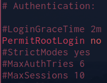

### Changing SSH port 
This one is completely optional. If you plan on using an SSH honeypot like [cowrie](https://github.com/cowrie/cowrie) then you'll eventually need to make some changes so your real SSH service can listen on another port and you'll be able to retain administrative access. This will then allow us to have port 22 open for attackers to hit the fake SSH service provided by the honeypot. If you change the port number just remember you'll have to specify the port with the `-p` option when connecting via SSH (e.g `$ ssh user@ipaddress -p 333`).

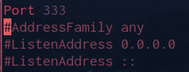

Re-open `/etc/ssh/sshd_config` in your editor, uncomment the `#Port 22` line and then change to whatever port number you'd like for your configuration. Then you can save and exit your editor. 

### Restart SSH daemon 

Now we need to restart the SSH service for these changes to take effect. 

`$ sudo service ssh restart`

Make sure to leave this current SSH session active and open another terminal window so that you can test the latest changes and see if you're able to still log in via SSH. If all goes well, then you've successfully made your access to the server significantly more secure! If you're having issues, make sure to double check the config was edited properly and that your public key is in fact inside your newly created honeypot user's `~/.ssh/authorized_hosts` file. 

### SSH alias
Instead of having to type in the username and IP address of our honeypot every time we want to connect, we can set up an [alias](https://ostechnix.com/how-to-create-ssh-alias-in-linux/) to make connecting a little more convenient.

On your personal machine, head over to the `.ssh` directory. Inside there you'll see a file called `config`. This isn't to be confused with the `sshd_config` that we edited above. If it isn't there you can just create the file, as it's empty by default! This will allow us to input all info pertaining to our server (e.g. username, ip address, port number, etc.) while also letting us give it a nickname. Follow the format below and input you own settings:

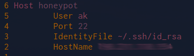

Going forward, anytime we want to connect to our server we can just use `$ ssh honeypot`. 

# Start your honeypot!
You now have a base install ready for further installation and configuration of your chosen honeypot! Feel free to reach out to me in Slack @AK with any questions or to correct an error in this document. 
