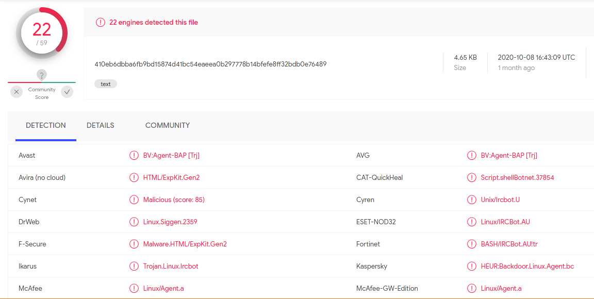

# Captured shell script sample
Captured within [Cowrie SSH honeypot](https://github.com/cowrie/cowrie). 12/06/2020 @ 08:45:11 UTC

*Cowrie.log*

----
Zip archive password: `infected`
----

**SHA256 410eb6dbba6fb9bd15874d41bc54eaeea0b297778b14bfefe8ff32bdb0e76489**

**MD5 	a167b2dba9768f426a9331951555c339**

The script appears to be fairly similar to what was described in a Sans ISC Diary post, from 2018. [https://isc.sans.edu/diary/Malicious+Network+Traffic+From+binbash/23591](https://isc.sans.edu/diary/Malicious+Network+Traffic+From+binbash/23591)

#

*VirusTotal detections.*

